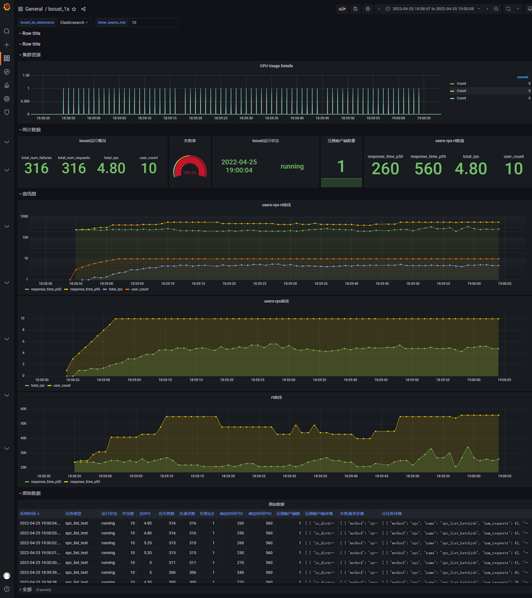

# 项目结构
├── docker-compose.yml  容器化安装配置，除了es和grafana必选，其他可以注释掉。建议用上dejavu  
├── elasticsearch       与es有关的配置和数据挂载路径  
│   ├── config  
│   │   └── elasticsearch.yml  es配置文件  
│   ├── data  
│   ├── logs  
│   └── plugins  
├── grafana                    与grafana有关的配置和数据挂载路径  
│   └── config  
│       ├── defaults.ini  
│       └── provisioning  
│           ├── dashboards  
│           │   └── locust_es_1s.json  
│           └── datasources  
├── imgs  
│   └── locust_es_1s.png  
├── kibana  
├── locust_es_1s.json          grafana保存的dashboard  
├── locust_scripts             locust需要加入的文件  
│   ├── control.py               控制locust自动停止，在locustfile.py里import进入即可自动执行  
│   ├── locust2db.py             数据获取并导入到es，在locustfile.py里import进入即可自动执行  
│   └── test_lt.py               性能测试用例所在文件  
└── readme.md  

# 数据流为：locust-->elasticsearch-->grafana  
## elasticsearch里索引通过dejavu查看：  

## locust_es_1s初步结果：  

